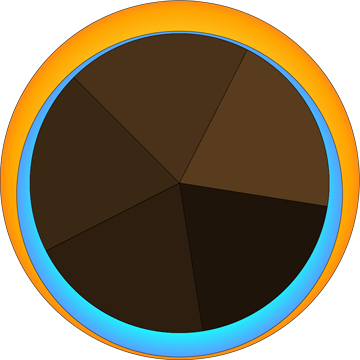

# TaskVisualizer
The goal of this app is to visualize your daily routine and determine whether you accomplish your daily task goals. This is just an app that I made for myself. In the future I would like to make it easier to use for others once I have time.

## Installation
This repo comes with a .jar for the GUI, but depends on Taskwarrior and Timewarrior to be installed as well as a hook script.
Visit the releases page: https://github.com/juanedflores/TaskVisualizer/releases

### Taskwarrior & Timewarrior
Follow the installation instructions for your platform:
* https://taskwarrior.org/download/
* https://timewarrior.net/docs/install/

### on-modify-timewarrior.py
This hook records tasks when starting a task via Taskwarrior e.g. `task 1 start` & `task 1 done`.

You might need to edit this file to change the full path to your own specific `timew` command location.

Be aware of the process to install hooks. You have to make it executable `chmod +x on-modify-timewarrior.py` and put it inside the `~/.task/hooks/` directory.
